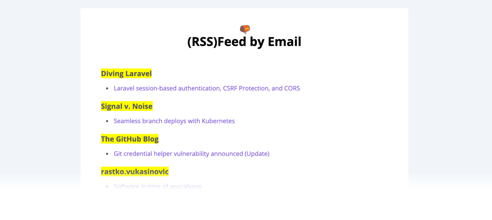

<p align="center">
  
</p>

> just-for-fun™ project.

## How it works

Every day at 6 AM - CEST (8 AM - UTC) we clone the git repository defined in the environment variables (`OPML_SUBSCRIPTIONS_REPO`), fetch all RSS feeds, and check if there is anything new (_new content from yesterday_).
After mapping the feed items + rendering e-mail templates (HTML, text) we send it by e-mail.

## Requirements

1. **Node v12.9.0+**
1. **Sendgrid account**
1. **A [git repository](https://github.com/eduardostuart/opml) including an [OPML](https://en.wikipedia.org/wiki/OPML) file**
1. **CircleCI account**

## Usage

```sh
node index.js
```

### Environment variables

| Key | Description | Default |
|---|---|---|
| SENDGRID_API_KEY | Your sendgrid api key | |
| OPML_SUBSCRIPTIONS_REPO | Git repository including an OPML file | |
| OPML_SUBSCRIPTIONS_REPO_FILE| Name of the opml file | subscriptions.xml |
| EMAIL_FROM | Email sender | |
| EMAIL_TO | Who will receive the e-mail | |

## Extras

E-mail template generated on [beefree.io](https://beefree.io/).

---

Thank you.
Here is a :cookie:
